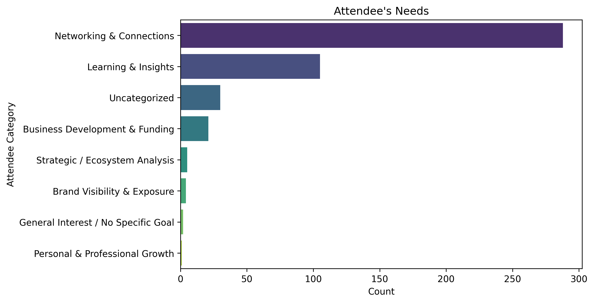

### 2025 Africa Startup & VC Landscape Analysis

-----

### Project Description

This project provides an end-to-end data analysis of the registration data for the "2025 Africa Startup & VC Landscape Preview" conference. The analysis aims to understand the profile of attendees, their motivations for joining, and how The Developer Network (TDN) can effectively meet their needs. This report offers key insights and actionable recommendations to enhance attendee engagement and optimize future events.

### Objective

The primary objective of this analysis is to uncover what attendees want from the conference to help the TDN better serve its community. The specific questions addressed are:

  * **Who Attended?** (Profiles of attendees, such as Founders, Investors, etc.)
  * **What Do Attendees Want?** (Their main expectations and goals for attending.)
  * **How Can the TDN Help Them?** (Actionable steps TDN can take to support their needs.)

### Data Source and Structure

The dataset, titled `2025_Africa_Startup&VC_Landscape_Preview...csv`, was collected via a registration form for the conference. It contains information about attendees, including their contact details, professional roles, company information, and their expectations for the event. The key columns used in the analysis are `describe_attendee` and `conference_expectation`.

### Cleaning and Preparation

The following steps were taken to prepare the data for analysis:

  * **Missing Values:** Null values were filled with "No Input" to ensure all data points were accounted for.
  * **Column Renaming:** Columns were renamed for clarity and ease of use (e.g., `'What best describes you?'` became `'describe_attendee'`).
  * **Data Type Conversion:** The `'created_at'` column was converted to a datetime format.
  * **Irrelevant Columns:** Columns with no data, such as `'coupon_code'` and `'amount'`, were dropped.
  * **Categorization:** A custom function was created to categorize attendee expectations based on keywords, grouping similar responses into defined categories like "Networking" and "Learning & Insights".

    ```python
    # Step 1: Clean 'phone_number' field
    df['phone_number'] = df['phone_number'].fillna(0).astype('int64').astype(str)
    df['phone_number'] = df['phone_number']

    # Replace all null values with "No Input"
    df.fillna("No Input", inplace=True)

    # Step 2: Rename 'created_at' to 'date_created' and Convert to datetime
    df = df.rename(columns={
        'created_at' : 'date_created',
        'What best describes you?' : 'describe_attendee', 
        'What best describes your organization?' : 'describe_organization',
        'If Founder: Are You Currently Raising Funds?' : 'founder_raising_fund?',
        'Startups: What region does your company focus on?' : 'startup_company_region',
        'What are your expectations for this conference?' : 'conference_expectation',
        'Company Name' : 'company_name',
        'Company Email' : 'company_email',
        'Company Website' : 'company_website',
        'Company Contact' : 'company_contact',
        'Short Bio' : 'short_bio',
        })
    df['date_created'] = pd.to_datetime(df['date_created'], errors='coerce')
    df['date_created'] = pd.to_datetime(df['date_created'].dt.strftime('%Y-%m-%d %H:%M:%S'))


    # Step 4: Drop Irrelevant Columns (columns with no data at all)
    irrelevant_cols = ['coupon_code', 'amount', 'amount_tax', 'amount_discount', 'custom_source', 'currency' 'eth_address', 'solana_address', 
                    'survey_response_rating', 'survey_response_feedback']
    df = df.drop(columns=irrelevant_cols, errors='ignore')

    df.to_excel('Cleaned_Dataset/Cleaned_Africa_Startup_2025.xlsx')
    ```

### Key Questions Answered

  * What are the top profiles of conference attendees?
  * What are the primary motivations of attendees for participating?
  * How can TDN's platform and resources be used to address attendee needs?

### Analysis Process

The analysis followed these key steps:

1.  **Data Loading and Inspection:** The raw CSV file was loaded into a pandas DataFrame.
2.  **Data Cleaning:** The data was cleaned and preprocessed as described in the "Cleaning and Preparation" section.
3.  **Exploratory Data Analysis (EDA):**
      * **Attendee Profiles:** The `describe_attendee` column was analyzed to identify the most common roles.
      * **Expectation Categorization:** A custom function was applied to the `conference_expectation` column to categorize qualitative text data into quantitative categories.
4.  **Visualization:** Bar charts were generated to visualize the top attendee profiles and their categorized expectations.

### Visualizations

  * **"Top 10 Attendees" Bar Chart:** This horizontal bar chart displays the count of the most common attendee types, clearly showing that **Founders** were the largest group, followed by **Investors** and **Startup Executives**.
  * **"Attendee's Needs" Bar Chart:** This vertical bar chart shows the distribution of attendee expectations across the defined categories. It highlights that the most significant need is for **Networking & Connections**, followed by **Learning & Insights**.

    ```python
    top10_attendees = df[df['describe_attendee'] != "No Input"]['describe_attendee'].value_counts().nlargest(10)

    top10_attendees.sort_values().plot(kind='barh', title='Top 10 Attendees')
    plt.ylabel("Count")
    plt.xticks(rotation=45)
    plt.savefig('Images/Top10_Attendees')
    plt.tight_layout()
    plt.show()


    plt.figure(figsize=(8,5))
    sns.countplot(
        y='attendee_category', 
        data=df_filtered, 
        order=category_counts.index, 
        palette='viridis'  # valid palette
    )
    plt.title("Attendee's Needs")
    plt.xlabel('Count')
    plt.ylabel('Attendee Category')
    plt.savefig('Images/Attendees_Needs')
    plt.tight_layout()
    plt.show()

    ```

### Insights & Findings


  * **Founder-Centric Audience:** The conference attracted a large number of founders (51%), making them the core audience. Investors and startup executives were also well-represented.
  * **Networking is Key:** The top priority for attendees is **networking**, with a strong desire to connect with investors, fellow founders, and industry experts.
  * **Knowledge is a Close Second:** The second-highest priority is gaining **knowledge and insights** into market trends, investment strategies, and emerging opportunities.
  * **Funding is a Major Driver:** A significant number of attendees expressed interest in **business development and funding**, indicating that many founders are actively seeking capital.



### Recommendations

Based on the findings, here are actionable recommendations for TDN to better serve its community:

  * **Facilitate Structured Networking:** Create dedicated virtual or in-person networking sessions and use a platform that allows attendees to easily filter and connect with specific roles (e.g., "Founders seeking funding" or "Investors specializing in Agrotech").
  * **Offer Targeted Content:** Develop and promote content (webinars, articles, and workshops) that specifically addresses the interests of founders and investors, focusing on topics like fundraising strategies, market analysis, and scaling a business in Africa.
  * **Launch a "TDN Matchmaking" Service:** Create a feature that connects founders with relevant investors and mentors based on their industry, stage, and funding needs.
  * **Showcase Success Stories:** Feature successful founders and investors from past events on the TDN platform to provide social proof and inspire the community.

### How to Reproduce

To reproduce this analysis, follow these steps:

1.  **Clone the Repository:**
    ```bash
    git clone https://github.com/Okwy009/TDN.git
    cd TDN
    ```
2.  **Install Dependencies:** Ensure you have Python and the necessary libraries installed.
    ```bash
    pip install pandas seaborn matplotlib scikit-learn
    ```
3.  **Run the Analysis Script:** Execute the Python script containing the analysis code.
    ```bash
    python your_analysis_script.py # Replace with the actual script name
    ```

This will generate the cleaned dataset and the visualizations in the `Images` folder.

### Credits & Contributions

  * **Project Lead:** [Data Frank](https://x.com/Okwy_Kwituxy)
  * **Tools & Libraries:** pandas, seaborn, matplotlib, scikit-learn.
  * **Repository:** [https://github.com/Okwy009/TDN](https://github.com/Okwy009/TDN)