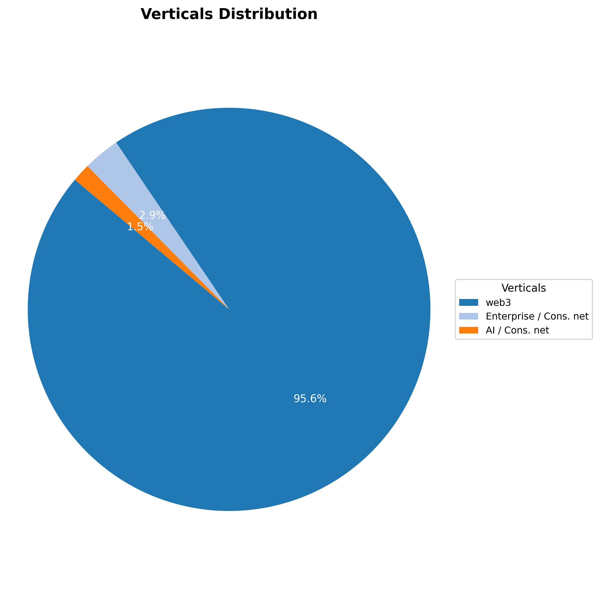

# The DAO Network Signal Investor Needs? Analysis

## Project Description
This project analyzes a dataset of potential investors to provide **The DAO Network (TDN)** with actionable insights. The goal is to understand investor profiles, their preferences, and how TDN can effectively position itself to attract funding and talent.

## Objective
The primary objective of this analysis is to answer key questions about the investor landscape, helping TDN tailor its outreach and value proposition to potential partners.

---

## Data Source and Structure
The analysis is based on the "Signal investors list.xlsx" dataset, which contains information on various investors, including their background, investment focus, and contact details.

- **Source:** An Excel file (`Signal investors list.xlsx`).
- **Columns:** The dataset includes columns such as `f_name`, `l_name`, `fund`, `country`, `position`, `verticals`, `range`, `avg_check`, and `recent`.
- **Collection:** The data was collected from a list of investors, from the TDN network.
- **Assumptions:** Missing values were handled based on best practices, such as filling numeric NaNs with 0 and categorical NaNs with "Not Listed."

---

## Cleaning and Preparation
A series of data cleaning steps were performed to ensure the dataset was ready for analysis:
1.  **Standardization:** Column names were standardized by removing spaces and special characters and converting them to lowercase (`snake_case`).

2.  **Duplicate Removal:** Duplicate rows were identified and removed.

3.  **Missing Values:** Rows with entirely missing data were dropped. Numeric missing values were filled with `0`, and categorical missing values were replaced with "Not Listed" to allow for accurate analysis.
4.  **Text Formatting:** Leading/trailing spaces were removed from text columns to ensure consistency.
5.  **Data Type Conversion:** The `recent` column was converted to a datetime format for potential temporal analysis.

    ```python
    # 1. Remove leading/trailing spaces from column names
    df.columns = df.columns.str.strip()

    # 2. Standardize column names (replace spaces with underscores)
    df.columns = (df.columns
                .str.replace(".", "")
                .str.replace(" ", "_")
                .str.lower()
                )

    # 3. Remove duplicate rows
    df = df.drop_duplicates()

    # 4. Remove rows where ALL values are NaN
    df = df.dropna(how='all')

    # Remove rows where key columns are NaN (optional)
    key_columns = ['f_name', 'l_name', 'fund']
    df = df.dropna(subset=key_columns)

    # 5. Standardize text columns (strip extra spaces)
    for col in df.select_dtypes(include='object').columns:
        df[col] = df[col].str.strip()

    # 6. Convert date columns to datetime format (if not already)
    date_columns = ['recent']
    for col in date_columns:
        df[col] = pd.to_datetime(df[col], errors='coerce')

    # 7. Handle missing values
    # Fill numeric NaNs with 0
    num_cols = df.select_dtypes(include='number').columns
    df[num_cols] = df[num_cols].fillna(0)

    # Fill non-numeric NaNs with 'Not Listed'
    non_num_cols = df.select_dtypes(exclude='number').columns
    df[non_num_cols] = df[non_num_cols].fillna('Not Listed')
    ```
---

## Key Questions Answered
This analysis addresses the following business questions:
- What are the most common investment verticals among potential investors?
- Which countries have the highest concentration of investors?
- What are the most common job titles or positions among these investors?
- What are the investment preferences (e.g., check size, verticals) for different investor positions?

---

## Analysis Process
The analysis involved several exploratory data analysis (EDA) techniques:
- **Descriptive Statistics:** Summarizing key metrics like the mean average check size.
- **Frequency Analysis:** Counting the occurrences of different categories like `verticals`, `country`, and `position` to understand their distribution.
- **Data Grouping:** Grouping data by `position` to uncover the most common preferences (e.g., `verticals`, `range`) for each investor role.

---

## Visualizations
The following visualizations were created to reveal key insights:
- **Pie Chart: Verticals Distribution:** This chart shows the percentage distribution of different investment verticals, highlighting which sectors are most popular among investors.
- **Bar Chart: Investors by Country:** This graph ranks the top 10 countries by the number of investors, revealing the most significant geographic hubs. 
- **Horizontal Bar Chart: Top 10 Positions:** This chart displays the most frequent job titles, or positions, held by the investors in the dataset, identifying the primary points of contact.
- **Table: Top 10 Positions' Needs:** A summary table was generated to show the investment preferences—such as the most common vertical, average check size, and typical affiliation—for the top investor positions.

---

## Insights & Findings
- **Verticals:** 

    **Web3** dominates the investment landscape, highlighting a strong interest in blockchain, decentralized applications, and emerging internet technologies.


- **Geography:** 

    The majority of investors are based in the **United States**, followed by the United Kingdom and Canada. This confirms where TDN's primary outreach efforts should be concentrated.
    

- **Investor Profiles:** The most common investor positions are `Partner`, `Investor`, and `Founder`. The data provides a clear picture of who TDN needs to engage.


- **Preferences:** 

    Executive and founding roles, such as **President & COO, Co-Founder, and VP-level founders,** command the highest average check sizes, often reaching **\$1M**, reflecting their significant decision-making authority and capital access. 

    This mix of institutional leaders and entrepreneur-investors consistently deploys some of the highest average check sizes in the dataset.


| Position                  | Most Common Verticals | Most Common Range | Avg Check Size | Most Common Affiliation     |
|---------------------------|-----------------------|-------------------|----------------|-----------------------------|
| Co-Founder                | Web3                  | $500k-$5M         | $1,000,000     | Initialized / 776           |
| GP                        | Web3                  | $500k-$5M         | $1,000,000     | Nfx                         |
| Pres. & COO               | Web3                  | $100k-$1M         | $1,000,000     | Coinbase Ventures           |
| VP Biz Dev & Cofounder    | Web3                  | $500k-$5M         | $1,000,000     | Convex Labs                 |
| Managing Director         | Web3                  | $50k-$1M          | $618,750       | Slow Ventures               |
| Principal                 | Web3                  | $500k-$2M         | $600,000       | Slow Ventures               |
| General Partner           | Web3                  | $50k-$2M          | $587,500       | Primomiglio Sgr             |
| Managing Partner          | Web3                  | $750k-$5M         | $521,429       | Upfront Ventures            |
| Analyst                   | Web3                  | $500k-$5M         | $500,000       | Hartmann Capital            |
| Cofounder & GP            | Not Listed            | $100k-$1M         | $500,000       | Firstminute Capital         |


---

## Recommendations
Based on these insights, here's how **The DAO Network (TDN)** can strategically leverage its value proposition:

- **Targeted Outreach:** TDN should focus its marketing and communication efforts on investors in the **United States**, particularly those with titles like `Partner` and `Investment Manager`.
- **Highlight Key Verticals:** When engaging with investors, TDN should emphasize its expertise and deal flow in **Web3, DeFi, and Gaming**. The talent marketplace and founder support programs are highly relevant to these sectors.
- **Position TDN as a Vetted Deal Flow Partner:** TDN can solve the problem of investors lacking trusted pipelines by presenting itself as a reliable source of **vetted African startups and talent** in key verticals.
- **Showcase a Diverse Portfolio:** To attract a wider range of investors, TDN should highlight its support for **talent and founders** across different sectors, not just the most popular ones. This demonstrates a robust ecosystem, not just a narrow focus.

---

## How to Reproduce
To reproduce this analysis, follow these steps:
1.  Ensure you have Python installed with the necessary libraries (`pandas`, `seaborn`, `matplotlib`, `numpy`).
2.  Save the `Signal investors list.xlsx` file in a `Datasets` folder.
3.  Execute the provided Python script. It will clean the data, generate visualizations, and print the summary tables.
4.  The cleaned dataset will be saved as `cleaned_signal_investors.xlsx`, and the plots will be saved in an `Images` folder.

---

## Credits & Contributions
- **Project Lead:** An end-to-end data analysis project by [Data Frank](https://x.com/Okwy_Kwituxy)

- **Tools & Libraries:**
    - Python
    - Pandas
    - NumPy
    - Matplotlib
    - Seaborn