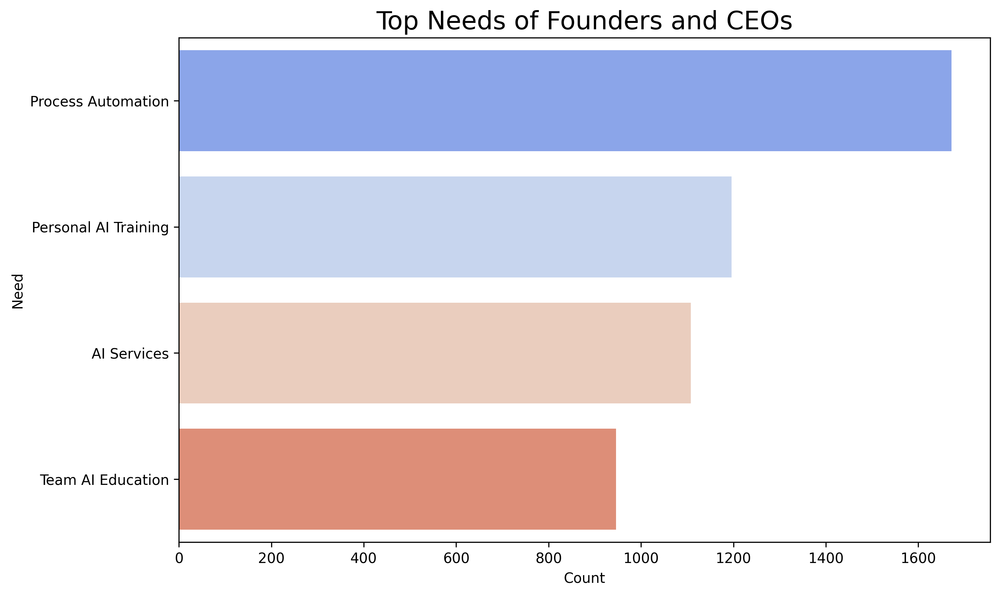
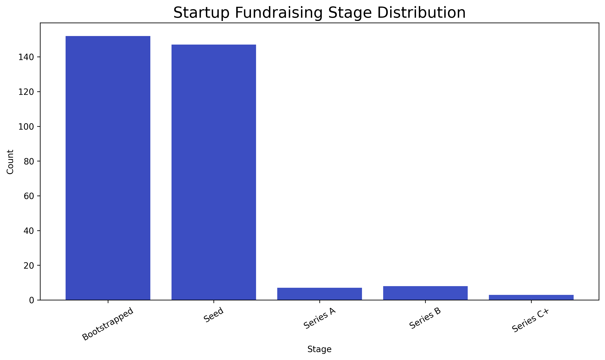
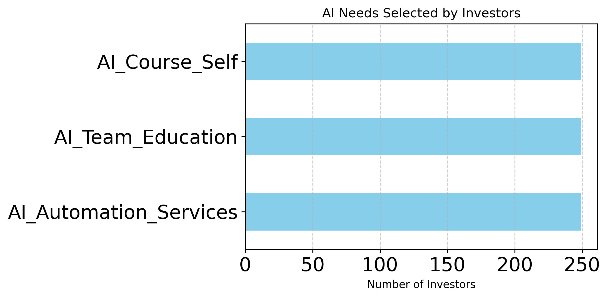
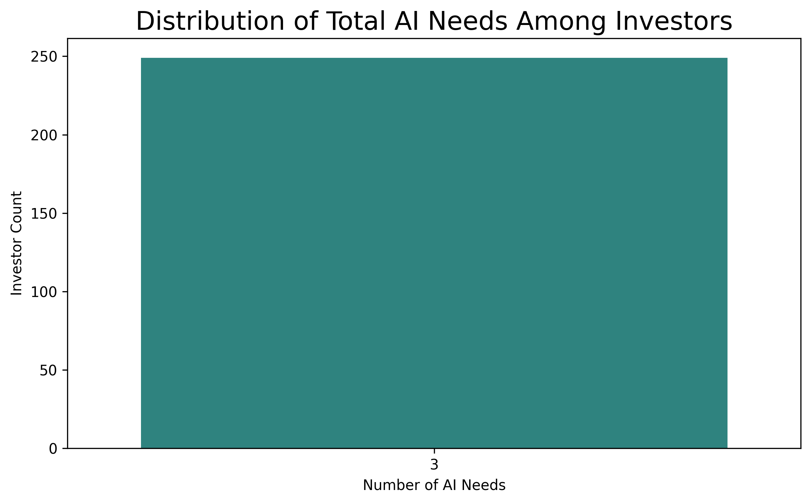
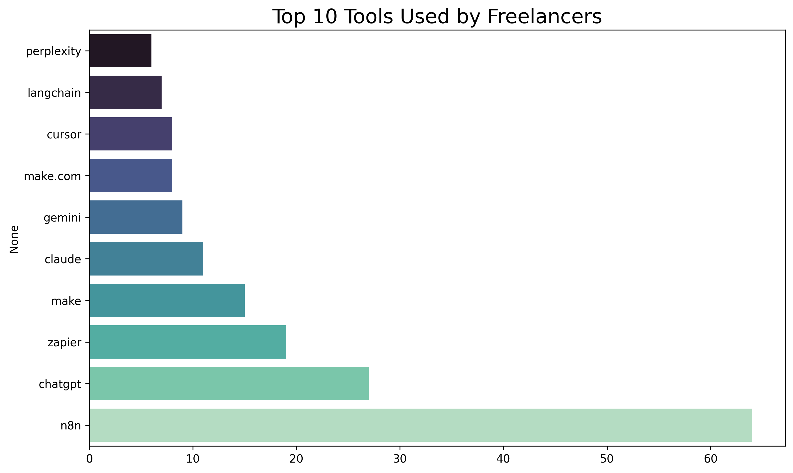
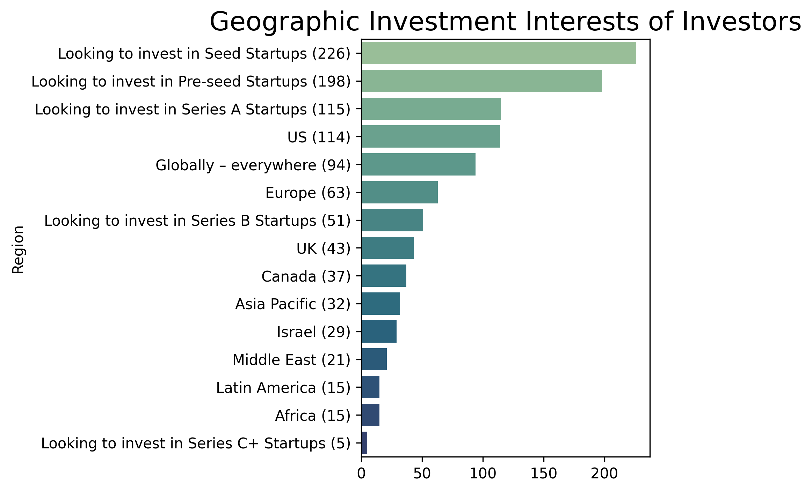

# 📊 AI Needs & Opportunities in the Startup Ecosystem

## 📌 Project Description

This project explores the needs, behaviors, and priorities of various stakeholders in the AI startup ecosystem—founders, startups, investors, freelancers, and companies. Using a rich dataset from a virtual AI showcase, we uncover valuable insights into what tools are used, which services are in demand, and where opportunities for collaboration exist.

By analyzing AI adoption trends, regional investment interests, and service gaps, this project provides a strategic understanding for decision-makers, accelerators, investors, and solution providers aiming to operate more effectively in the AI landscape.

---

## 🎯 Objective

The primary goal of this project is to answer:

> **What do different players in the AI ecosystem need right now?**

We focus on identifying:

- Founders’ interest in AI services, education, and automation  
- Investors' focus by startup stage and region  
- Startups' funding stages and global presence  
- Freelancers' tool usage and service alignment  

---

## 📂 Data Source & Structure

The dataset was sourced from a Google Form survey of attendees at a virtual AI showcase conference.

**Key Sheets Analyzed:**

- `Full list of attendees` (founders and executives)  
- `AI freelancers & agencies`  
- `AI investors`  
- `AI startups`  
- `Companies seeking AI automation`  

**Structure:**  
Each sheet includes participant information like name, email, company name, stage of funding, regional interest, tools used, and AI-related needs. Some columns are binary flags (1 for selected), while others are free-text inputs.

**Assumptions Made:**

- Null or generic text (e.g., “none”, “not sure”) was treated as non-responses  
- Stage and region indicators are mutually exclusive unless explicitly multi-selected  

---

## 🧹 Cleaning and Preparation

**Steps taken:**

- Stripped whitespace and line breaks from column names  
- Mapped long column headers to concise labels  
- Converted binary responses to integers (1 = selected, 0 = not selected)  
- Cleaned free-text responses using regex (e.g., tool lists like “Zapier + GPT” → `["Zapier", "GPT"]`)  
- Removed irrelevant or ambiguous values (“n/a”, “none at the moment”)  
- Melted wide-form datasets into long format for region/stage analysis  

---

## ❓ Key Questions Answered

1. What are the primary AI-related needs of startup founders?  
2. Which investors are interested in which funding stages?  
3. What tools do AI freelancers use most frequently?  
4. Where are investors most interested in placing capital geographically?  
5. How do startup fundraising stages align with regional presence?  
6. Which founders want services, training, or AI education for their teams?  

---

## 🔍 Analysis Process

We used the following methods:

- Frequency counts with `collections.Counter` for categorical needs and tools  
- Data reshaping (`melt`) to map stages and regions  
- Bar plots using Seaborn and Matplotlib  
- Grouping and filtering to match startups with investors  
- Merging datasets (e.g., matching freelancers with founders needing services)  

---

## 📈 Insights & Findings

### 1. **Top Needs of Founders**
- **Process Automation** is the top priority  
- Followed by: AI Services, Personal AI Training, and Team AI Education

  
  

---

### 2. **Startup Stage Distribution**
- Majority are at **Seed** and **Pre-seed** stages  
- Very few in Series B or later

  
  

---

### 3. **Investor Interests**
- Most common focus: **Pre-seed** and **Seed**  
- Investors typically select **1–2 AI needs**

  
  

---

### 4. **Freelancers**
- Top tools used: `n8n`, `OpenAI`, `ChatGPT`, `Make`  
- Highly varied tool stack, concentrated around top automation platforms

  

---

### 5. **Regional Trends**
- Investor interest highest in: **US**, **Europe**, and **Global**  
- Startups show presence in **Asia Pacific** and **Africa**

  

---

## 📊 Visualizations Summary

| Visualization                       | Description                                      |
|------------------------------------|--------------------------------------------------|
| `founders_needs.png`               | Breakdown of AI needs among founders            |
| `founders_primary_needs.png`       | Primary needs selected by each founder          |
| `investor_focus_stage.png`         | Stage focus of AI investors                     |
| `startup_stages.png`               | Fundraising stage distribution of startups      |
| `top_freelancer_tools.png`         | Top 10 AI tools used by freelancers             |
| `startup_stage_region.png`         | Startup stage vs. region distribution           |
| `investor_ai_needs_distribution.png` | Count of AI-related needs per investor         |
| `ai_needs_investor_selected.png`   | Type of AI needs investors selected             |
| `geographic_investment_interests.png` | Investor interest by global region           |

---

## 📌 Recommendations

- **AI Service Providers:** Prioritize founders interested in **Process Automation** and **AI Services**  
- **Freelancers:** Focus on toolkits involving **Zapier**, **ChatGPT**, **Make**, and reach out to AI-hungry founders  
- **Investors:** Expand to **Africa** and **Asia Pacific**—high founder activity, underrepresented in funding  
- **Accelerators / Ecosystem Builders:** Enable matchmaking based on stage & region alignment  
- **Training Programs:** Launch targeted training for founders and their teams with real-world AI applications  

---

## 🔁 How to Reproduce

1. Clone the repository and install requirements:

   ```bash
   pip install pandas seaborn matplotlib wordcloud
